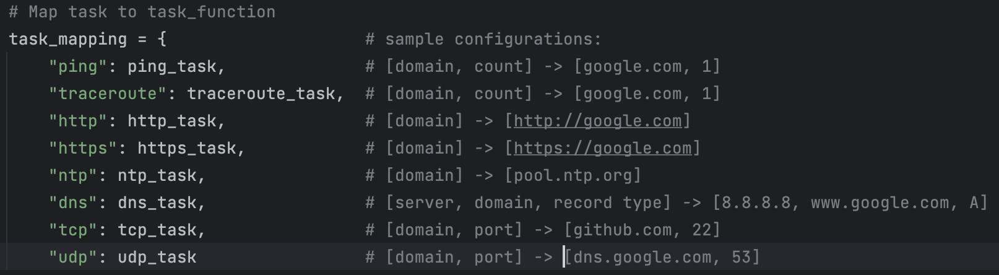

********************
About the Developer:
********************
Author: Jovanny Gochez
Course: Intro to Computer Networks
Assignment: Socket Programming II: TCP/IP Programming
Due Date: March 10, 2024
Last Modified: March 10, 2024 2:49 PM CST

**************************
Accessing the Application:
**************************
To execute program you must execute this file: management_service.py

If in Unix/Unix derivative system, I found success accessing the programming in this list:
1) Make sure "python3" and "pip" is installed in environment
2) Make sure ntplib, dnspython, and requests are installed: python3 -m pip install [insert_package_name]
3) Make sure you have accessed the directory where file is in: "DistributedNetwork/src/"
4) Access the main file to use program: "python3 network_monitoring.py"
5) If issues with network connections (e.g., errno 54) or permission errors occur, try: "sudo python3 network_monitoring.py"

In my machine I use the following CLI commands: 
1) Access directory: cd Desktop/MyProjects/CompNetProjects/NetworkProgramming/DistributedNetwork/src/  
2) Access file: sudo python3 network_monitoring.py

***********************
Purpose of Application:
***********************
One of the fundamental functionalities of Network Programming is the persistent connection of a TCP/IP network.
The goal is to maintain persistent connections with algorithms to handle any unwarranted disconnections and failures
in message and response interactions between a client and a server. Further expanding this functionality, the ability
to integrate important diagnostic tools in a server which can be accessed by any client to interact with the tools
only further elevates the functionality of Network Programming. In this assignment the user will have created
a Distributed Network System that allows for the creation of a server that can handle multiple client connections and in
turn provides users with an assortment of concurrent task which yield live results which can be retrieved at request.

**************************
Operating the Application:
**************************
Below are important screenshots that help display important features of the program and fulfillment of 
assignment requirements:

Model used for the program:
 - UI of the program represent Management Service (management_service.py)
 - Client connects to Server, aka, Monitoring Service (monitoring_service.py)
 - From Server (Monitoring Server) we execute Monitoring Task with unique IDs (monitoring_service_task.py)

Display of the dynamically outputted results of each task in JSON files with timestamps and detail of the
task identified by a unique ID which the JSON file is named after.

Code shows the client function that establishes connection with server has a safeguard for disconnection.
The code uses an exponential backoff method with 3 max tries, giving us a 1 second, 2 second, 4 second, and
finally 8 second wait for attempted reconnection of exception is continuously called.

Image is a sample configuration for each task. To try and execute abstraction, the UI does not provide
unique config requests, instead it iterates over the same line ("Enter config (Q to stop)") which appends
every new value into a list which is then mapped into a function that reads the name of the task and its
configurations as: persistent_connection(function, *args). Thus the image provided gives the user an idea of
how many configurations exist for each task and a sample to use.

==========================================================================================================

The first 16 images, named image 1, image 2, etc., will display the entire use of our program.
More importantly it will demonstrate these important functionalities in this order that are meant
to fulfill the requirements:

 - Execution of concurrent tasks on a server identified by a unique ID 
 - Tasks include: ping, traceroute, http/s, ntp, dns, tcp/udp. 
 - Functionalities include adding pausing, resuming and stopping services. 
 - Have readily available the output from each task which are outputted dynamically into JSON files. 
 - Throughout the program we will have frequent displays of command and status updates for every thread running.

The screenshots are visually combined as one long thread displaying the entire use of the program in this order:

 - Access monitoring service by adding task "ping" with ID 0100, frequency of 5s, and connecting to google with 1 hop. 
 - Pause task "ping"
 - Resume task "ping"
 - Render the output from task "ping" before paused and after paused to show these functions work 
 - Render the current status of "ping"
 - Stop task "ping" and render its status to demonstrate status function works and is up-to-date 
 - After demonstrating that all these functions work with ping we add 7 more concurrent task of the remaining task 
 - Add task "traceroute"
 - Add task "http"
 - Add task "https"
 - Add task "ntp"
 - Add task "dns"
 - Add task "tcp"
 - Add task "udp"
 - Display config_file which displays every single task created with their configurations and current status

